# Tessera

<a href="https://glama.ai/mcp/servers/@besslframework-stack/project-tessera">
  
</a>

**Make Claude Desktop remember your entire workspace.**

You have hundreds of documents — PRDs, meeting notes, decision logs, session records. Claude Desktop can read files you attach, but it can't search across your whole workspace. Tessera bridges that gap.

It indexes your local documents into a vector store and connects to Claude Desktop via MCP. When you ask a question, Claude automatically searches your files and answers with context — and remembers across sessions.

<p align="center">
  
</p>

<a href="https://glama.ai/mcp/servers/@besslframework-stack/project-tessera">
  
</a>

### Why Tessera?

- **Zero external dependencies** — No Ollama, no Docker, no API keys. Just `pip install` and go.
- **Cross-session memory** — Claude remembers your decisions, preferences, and context between conversations.
- **Knowledge graph** — Visualize how your documents connect to each other.
- **Auto-sync** — File watcher detects changes and re-indexes automatically in the background.
- **100% local** — Everything stays on your machine. Nothing leaves your laptop.

## How it works

1. **You point Tessera at your document folders** (Markdown, CSV, session logs)
2. **Tessera indexes them locally** using fastembed (ONNX) + LanceDB
3. **Claude Desktop searches them automatically** via MCP tools
4. **Only changed files are re-indexed** on each sync

## Get started

### Install + Setup

```bash
git clone https://github.com/besslframework-stack/project-tessera.git
cd project-tessera

python3 -m venv .venv && source .venv/bin/activate
pip install -e .

tessera init
```

`tessera init` walks you through everything:
- Picks your document root directory
- Scans for folders with documents
- Lets you choose which to index
- Downloads the embedding model (~220MB, once)
- Generates `workspace.yaml` automatically
- Shows you the Claude Desktop config snippet
- Offers to index immediately

### Connect to Claude Desktop

`tessera init` prints the config snippet. Add it to your `claude_desktop_config.json`:

```json
{
  "mcpServers": {
    "tessera": {
      "command": "/path/to/project-tessera/.venv/bin/python",
      "args": ["/path/to/project-tessera/mcp_server.py"],
      "cwd": "/path/to/project-tessera"
    }
  }
}
```

Restart Claude Desktop. You'll see "tessera" in the MCP integrations.

## What Claude can do with Tessera

| Tool | What it does |
|------|-------------|
| **Search** | |
| `search_documents` | Semantic + keyword hybrid search across all your docs |
| `unified_search` | Search documents AND memories in one call |
| `read_file` | Read any file's full content |
| `list_sources` | See what's indexed |
| **Memory** | |
| `remember` | Save knowledge that persists across sessions |
| `recall` | Search past memories from previous conversations |
| `learn` | Auto-learn: save and immediately index new knowledge |
| `list_memories` | Browse saved memories with previews |
| `forget_memory` | Delete a specific memory |
| `export_memories` | Batch export all memories as JSON |
| `import_memories` | Batch import memories from JSON |
| `memory_tags` | List all unique tags with counts |
| `search_by_tag` | Filter memories by specific tag |
| **Knowledge Graph** | |
| `find_similar` | Find documents similar to a given file |
| `knowledge_graph` | Build a Mermaid diagram of document relationships |
| `explore_connections` | Show connections around a specific topic |
| **Indexing** | |
| `ingest_documents` | Index your documents (first-time setup or full rebuild) |
| `sync_documents` | Incremental sync — only re-index changed files |
| **Workspace** | |
| `project_status` | See what's changed recently in each project |
| `extract_decisions` | Find past decisions from logs |
| `audit_prd` | Check PRD quality (section coverage, versioning) |
| `organize_files` | Move, rename, archive files |
| `suggest_cleanup` | Detect backup files, empty dirs, misplaced files |
| `tessera_status` | Server health: tracked files, sync history, cache stats |
| `health_check` | Comprehensive workspace diagnostics with recommendations |
| `search_analytics` | Search usage patterns, top queries, response times |
| `check_document_freshness` | Detect stale documents older than N days |

## CLI commands

```bash
tessera init                    # Interactive setup
tessera ingest                  # Index all configured sources
tessera ingest --path ./docs    # Index a specific directory
tessera sync                    # Re-index only changed files
tessera status                  # Show all projects
tessera status my_project       # Show one project's status
tessera check                   # Check workspace health
tessera version                 # Show version
```

## Architecture

```
Your documents (Markdown, CSV)
        |
   Parse & chunk (~800 chars)
        |
   Embed locally (fastembed/ONNX)
        |
   Store in LanceDB (local vector DB)
        |
   Expose via MCP server
        |
   Claude Desktop searches automatically
```

## Configuration

After `tessera init`, your `workspace.yaml` looks like:

```yaml
workspace:
  root: /Users/you/Documents
  name: my-workspace

sources:
  - path: project-alpha
    type: document
    project: project_alpha

projects:
  project_alpha:
    display_name: Project Alpha
    root: project-alpha
```

Edit it anytime to add/remove sources. Run `tessera sync` after changes.

### Tuning

All parameters are configurable in `workspace.yaml`:

```yaml
search:
  reranker_weight: 0.7       # Semantic vs keyword balance (1.0 = pure semantic)
  max_top_k: 50              # Max results per search

ingestion:
  chunk_size: 1024           # Text chunk size for indexing
  chunk_overlap: 100         # Overlap between chunks

watcher:
  poll_interval: 30.0        # Seconds between file system scans
  debounce: 5.0              # Wait before syncing after changes
```

## License

AGPL-3.0 — see [LICENSE](LICENSE).

For commercial licensing: bessl.framework@gmail.com